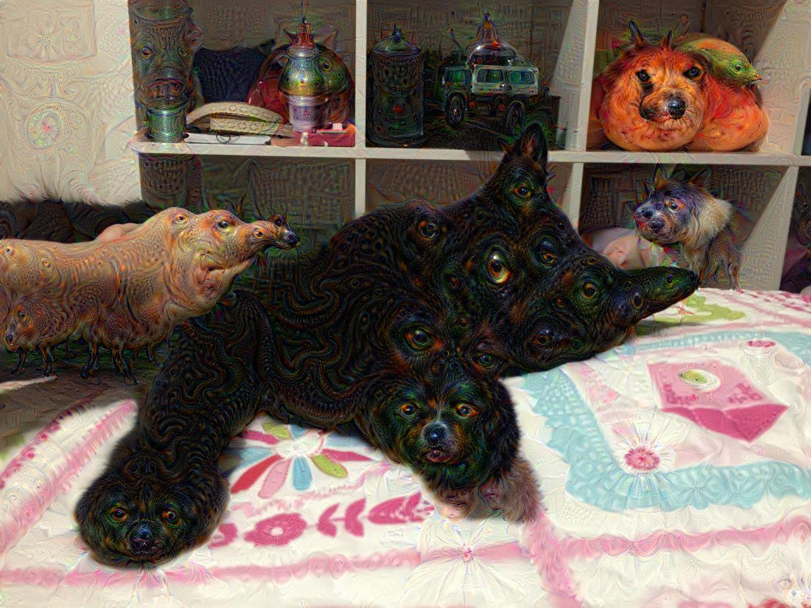

# PyDream

## Introduction
This repository forks the original [Google DeepDream](https://github.com/google/deepdream) implementation in IPython Notebook that complements Google Research [blog post](http://googleresearch.blogspot.ch/2015/06/inceptionism-going-deeper-into-neural.html) about Neural Network art.

Besides that, pure `Python` code is extracted from the Notebook together with comments trying to provide a thorough explaination of the code.  

## Requirements
* Caffe and PyCaffe(see [Caffe installation instructions](http://caffe.berkeleyvision.org/installation.html))
* Google Protobuf
* NumPy
* SciPy
* PIL

## Examples
Original image:
  

Dream image:

# References

[Photo Gallery](https://photos.google.com/share/AF1QipPX0SCl7OzWilt9LnuQliattX4OUCj_8EP65_cTVnBmS1jnYgsGQAieQUc1VQWdgQ?key=aVBxWjhwSzg2RjJWLWRuVFBBZEN1d205bUdEMnhB)  
Original authors:
* [Alexander Mordvintsev](mailto:moralex@google.com)
* [Michael Tyka](https://www.twitter.com/mtyka)
* [Christopher Olah](mailto:colah@google.com)
